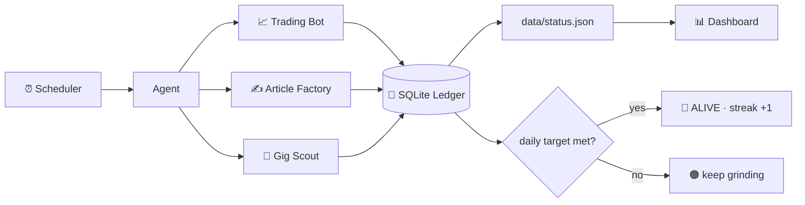

<div align="center">

# ⚡ Earner

### An autonomous earning agent — it works the grind every day so you don't have to.

*Runs earning strategies on a schedule · records every cent · chases its daily survival target*


</div>

> 💡 **The honest pitch** — Earner will not magically print money (anything promising that is lying to you).
> What it *does* is automate the legitimate grind across three channels — **freelance gig scouting,
> affiliate article writing, and rule-based crypto trading** — then track every result in a ledger
> and ask one question every day: *"did we survive?"*
>
> Real income unlocks when you plug in your own accounts (affiliate tag, exchange keys) —
> each strategy tells you exactly what it needs.

---

## ✨ Features

| | |
|---|---|
| 🔁 **Set & forget** | Scheduler loop re-runs every strategy automatically |
| 💼 **Gig Scout** | Scans live remote-job APIs, scores gigs against your skills, writes ready-to-send proposals |
| ✍️ **Article Factory** | Generates SEO buyer-guide articles pre-wired with your affiliate links |
| 📈 **Trading Bot** | SMA-crossover crypto trader — paper mode by default, strict TP/SL/daily-loss guards |
| 🧾 **Honest ledger** | SQLite journal of every earn / spend / lead — simulated money is *never* counted as real |
| 📊 **Live dashboard** | Dark-themed zero-dependency UI: survival bar, streak, wallet, transactions |
| 🔔 **Notifications** | Discord / Slack webhook alerts on leads and trades |
| 🧩 **Plugin design** | New strategy = one class + one registry line + one YAML block |
| ✅ **Actually tested** | 15 unit tests + 370-cycle trade simulation, CI on Windows & Linux |

## 🚀 Quick Start

```bash
git clone https://github.com/Nandan222001/earner.git
cd earner
pip install -r requirements.txt

python earner.py run --once   # first full earning cycle
python earner.py status       # did we survive today?
python earner.py run          # keep working forever (default: every 30 min)
```

**Dashboard** — with XAMPP/Apache (or any static server) pointed at the folder:
<http://localhost/earner/dashboard/>

<!-- 📸 Pro tip: screenshot the dashboard after a few runs and embed it here:
 — repos with screenshots get noticeably more clicks -->

## 🕹️ Commands

| Command | What it does |
|---|---|
| `python earner.py run --once` | single cycle of all enabled strategies |
| `python earner.py run` | loop forever on schedule (`loop_interval_minutes`) |
| `python earner.py status` | console status card + refreshes dashboard feed |
| `python earner.py earn --strategy micro_tasks --amount 45 --note "gig paid"` | log **real** money received |
| `python earner.py reset-paper` | reset simulated trading wallet to $100 |

## 🏗️ Architecture



## 💰 The Three Strategies

| Strategy | What it automates | The one thing only *you* can do | Earns via |
|---|---|---|---|
| 💼 **Gig Scout** | Scans job APIs → scores matches by your skills → drafts proposals | Click *send* on the proposal (platforms need a human) | Freelance income — fastest first dollar |
| ✍️ **Article Factory** | Writes SEO buyer-guides with affiliate links daily | Add your affiliate tag once; publish where traffic exists | Passive commissions |
| 📈 **Trading Bot** | Signals, entries, exits, risk caps — forever, in paper mode | Fund an exchange account & add API keys for live mode | Speculative — **can lose money**, start tiny |

## 🔓 Go-Live Checklist

1. **Gigs** → edit `strategies.micro_tasks.skills` in `config.yaml` → check `data/output/gigs/*.md` → personalize → send → get paid → `python earner.py earn ...` 🎉
2. **Affiliate** → join [Amazon Associates](https://affiliate-program.amazon.com) → put your tag in `amazon_tag` → (optional) enable the `wordpress:` block to auto-publish drafts
3. **Trading LIVE** → exchange API keys (**withdrawals disabled!**) → `mode: live` + `i_understand_trading_risk: true` → `pip install ccxt` → `stake_usd_per_trade: 5` → let it prove itself before scaling

## ➕ Write Your Own Strategy (~20 lines)

```python
# strategies/my_strategy.py
from .base import BaseStrategy

class MyStrategy(BaseStrategy):
    name = "my_strategy"

    def run(self, ctx):
        ctx.ledger.record(self.name, "lead", 0, note="opportunity found")
        return {"ok": True}
```

Register it in `strategies/__init__.py`, flip it on in `config.yaml`, done.
Full guide in [CONTRIBUTING.md](CONTRIBUTING.md).

## 🗺️ Roadmap

- [ ] Email notifications for new gig leads
- [ ] Backtesting module for trading strategies
- [ ] Multi-symbol portfolio (ETH/SOL rotation)
- [ ] OpenAI-powered article polish (config keys already reserved)
- [ ] More public job feeds (WeWorkRemotely RSS, HackerNews who's hiring)
- [x] ~~CI on Windows & Linux~~

## ❓ FAQ

<details>
<summary><b>Will this make me money automatically?</b></summary>

It automates ~90% of the work but no honest bot can guarantee cash — platforms require a human account owner. Earner gets you to the finish line (a drafted proposal, a published article, a tested strategy); you take the last step.
</details>

<details>
<summary><b>Why is paper-trading money shown separately?</b></summary>
Because honesty is a feature. Simulated PnL (<code>paper_earn</code>) never counts toward the survival target — only <code>earn</code> records from real money do.
</details>

<details>
<summary><b>Is live trading safe?</b></summary>
It has TP/SL and a hard daily-loss cap, but markets are risky. Use exchange keys with <b>withdrawals disabled</b>, tiny stakes, and money you can afford to lose.
</details>

## ⚖️ Legal & Risk Notes

- Respect each platform's Terms of Service when sending proposals or publishing content
- Trading involves real risk of loss — never fund it with money you need
- Affiliate programs require disclosure; generated articles include one (FTC-friendly)
- Income may be taxable where you live — your ledger doubles as record-keeping aid

## 🤝 Contributing

PRs welcome! Read [CONTRIBUTING.md](CONTRIBUTING.md) — new strategies are the most valuable contributions.

## ⭐ Support the project

If Earner saved you time (or landed you a gig), consider giving it a star — it helps others find it.

[](https://star-history.com/#Nandan222001/earner&Date)


## Going live with each strategy

1. **Gigs** - edit `strategies.micro_tasks.skills` in `config.yaml`. Check
   `data/output/gigs/*.md`, personalize the draft proposal, send it. When paid,
   `python earner.py earn ...` and your streak grows.
2. **Affiliate** - sign up at [Amazon Associates](https://affiliate-program.amazon.com),
   put your tag into `amazon_tag`. Generated articles in
   `data/output/articles/` then contain monetized links. To auto-publish,
   enable the `wordpress:` block (needs an Application Password).
3. **Trading LIVE** - create exchange API keys (withdrawals disabled!),
   fill `api_key/api_secret`, set `mode: live`, add
   `i_understand_trading_risk: true`, `pip install ccxt`, start tiny
   (`stake_usd_per_trade: 5`). The stop-loss / take-profit / daily-loss-cap
   guards apply to both paper and live modes.

## Adding your own strategy

Create `strategies/my_thing.py`:

```python
from .base import BaseStrategy

class MyThing(BaseStrategy):
    name = "my_thing"
    def run(self, ctx):
        ctx.ledger.record(self.name, "lead", 0, note="opportunity found")
        return {"ok": True}
```

Register it in `strategies/__init__.py` (`REGISTRY`) and add an
`enabled: true` block in `config.yaml`.

## Files

- `core/agent.py` orchestrator, `core/ledger.py` SQLite ledger, `core/utils.py` helpers
- `strategies/` pluggable earners
- `data/earner.db` all transactions, `data/status.json` dashboard feed, `data/earner.log`
- `dashboard/index.html` zero-dependency UI

## Legal / risk notes

- Respect every platform's terms when sending proposals or publishing.
- Trading involves real risk of loss; use money you can afford to lose.
- Affiliate programs require disclosure (the generated articles include one).
- Income is taxable where you live - the ledger is your record-keeping aid.
